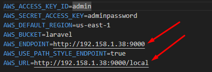

# DESAFIO TÉCNICO SEPLAG-MT
## Número da inscrição: 8837 - Perfil: DESENVOLVEDOR PHP - SÊNIOR
### API Laravel 12, PostgreSQL 15, MinIO e Nginx para SEPLAG MT

Este projeto é uma API desenvolvida com Laravel 12, utilizando PostgreSQL 15 como banco de dados, MinIO para armazenamento de arquivos e Nginx como servidor web.

## Requisitos

* Docker e Docker Compose instalados.
* Composer instalado.
* Postman (ou similar) para testar as rotas da API.

## Instruções de Execução

1.  **Clonar o Repositório:**

    ```bash
    git clone https://github.com/rafaelfreba/desafio-seplag-php.git
    cd desafio-seplag-php
    ```

2.  **Instalar Dependências do PHP:**

    ```bash
    composer install
    ```
    
3.  **Subir os Contêineres Docker:**

    ```bash
    docker-compose up -d --build
    ```

4.  **Importar Coleção do Insomnia:**

    * Abra o Insomnia.
    * Importe a coleção de rotas da API, localizada na raiz do projeto **(Insomnia_2025-04-05.har)**.

      Obs.: caso esteja rodando os containeres em uma VM altere as variáveis de ambiente no arquivo ``.env`` conforme imagem:
      

5.  **Testar as Rotas da API:**

    * Utilize o Insomnia para enviar requisições para as rotas da API e verificar o funcionamento.
    1) Gere o token na rota login;
    2) Antes de realizar a requisição ajuste a autenticação passando o Bearer Token.

## Informações Adicionais

* Certifique-se de que as portas necessárias (por exemplo, a porta 80 para o Nginx) estejam disponíveis em sua máquina.
* O MinIO estará acessível através da porta configurada no `docker-compose.yml`.
* O PostgreSql estará acessivel através da porta configurada no `docker-compose.yml`.
